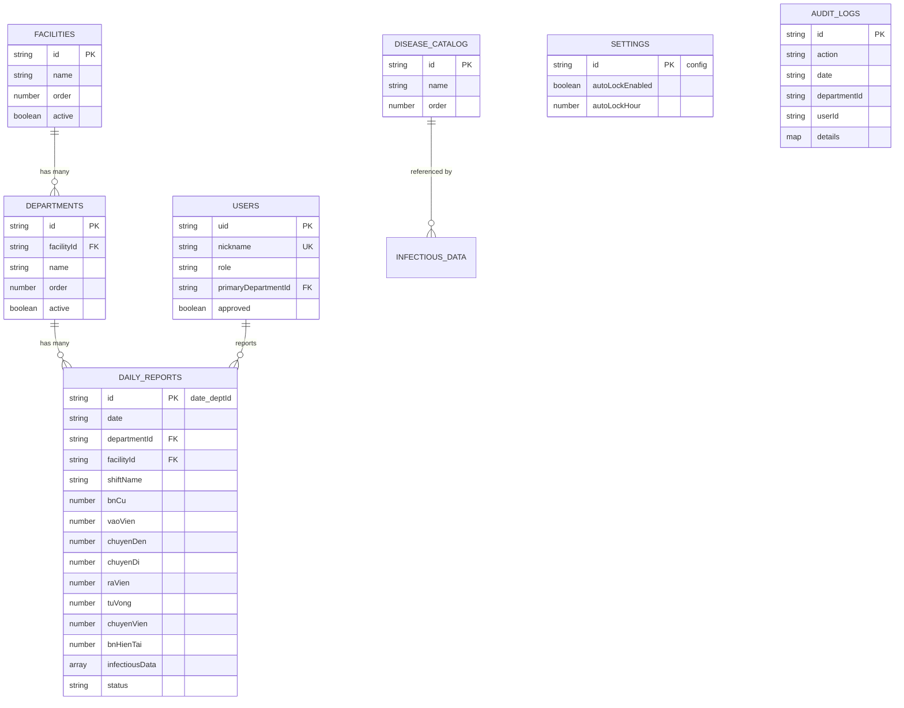

# CODEBASE.md — HospitalStat-VT

> Hệ thống Thống kê Bệnh viện nội trú — Viện Nhiệt đới Trung ương
> React + Firebase (Firestore, Authentication, Hosting, Cloud Functions)
> Last updated: 2026-03-23

---

## 1. Tổng quan kiến trúc

```
┌───────────────────────────────────────────────────────┐
│                     FRONTEND                          │
│  React 18 + Vite + TailwindCSS + shadcn/ui            │
│  SPA với React Router v6                              │
├───────────────────────────────────────────────────────┤
│                     BACKEND                           │
│  Firebase Auth (email/pass, nickname-based)            │
│  Cloud Firestore (6 collections)                      │
│  Cloud Functions v2 (resetPassword)                   │
│  Firebase Hosting                                     │
└───────────────────────────────────────────────────────┘
```

**Tech Stack:**
| Layer | Công nghệ |
|-------|-----------|
| Framework | React 18 + Vite |
| Routing | react-router-dom v6 |
| State | React Context (AuthContext) + local useState |
| UI | TailwindCSS + shadcn/ui (Radix primitives) |
| Icons | lucide-react |
| Dates | date-fns |
| Backend | Firebase (Auth, Firestore, Functions, Hosting) |
| Region | asia-southeast1 |

---

## 2. Database Schema (Firestore)

### 2.1 Collection: `facilities`
> Danh mục cơ sở (bệnh viện có nhiều cơ sở)

| Field | Type | Mô tả |
|-------|------|-------|
| `name` | string | Tên cơ sở (VD: "Cơ sở 1") |
| `order` | number | Thứ tự sắp xếp |
| `active` | boolean | Trạng thái khóa/mở (`true` = hoạt động) |
| `createdAt` | timestamp | |
| `updatedAt` | timestamp | |

**Document ID:** Tự gán (VD: `cs1`, `cs2`)
**Seed data:** 2 cơ sở (Cơ sở 1, Cơ sở 2)

---

### 2.2 Collection: `departments`
> Danh mục khoa, thuộc cơ sở

| Field | Type | Mô tả |
|-------|------|-------|
| `name` | string | Tên khoa (VD: "Nội 1", "Bệnh nhiệt đới") |
| `facilityId` | string | FK → facilities.id |
| `order` | number | Thứ tự sắp xếp trong cơ sở |
| `active` | boolean | `true` = hoạt động, `false` = khóa |
| `createdAt` | timestamp | |
| `updatedAt` | timestamp | |

**Document ID:** Tự gán (VD: `noi1`, `benh_nhiet_doi`)
**Seed data:** 19 khoa (14 CS1 + 5 CS2)

**Logic khóa:** Khi cơ sở bị khóa → cascade khóa tất cả khoa thuộc cơ sở. Mở khóa cơ sở → mở khóa tất cả khoa. Không thể mở khóa khoa nếu cơ sở đang khóa.

---

### 2.3 Collection: `users`
> Người dùng hệ thống

| Field | Type | Mô tả |
|-------|------|-------|
| `nickname` | string | Tên đăng nhập (chữ thường, không dấu, a-z0-9.) |
| `email` | string | Auto-gen: `{nickname}@hospitalstat.local` |
| `displayName` | string | Tên hiển thị |
| `fullName` | string | Họ tên đầy đủ |
| `role` | string | `admin` \| `kehoach` \| `khoa` |
| `position` | string | "Lãnh đạo BV" \| "Trưởng khoa/phòng" \| "Phó trưởng khoa/phòng" \| "Nhân viên" |
| `title` | string | "Bác sĩ" \| "Điều dưỡng/KTV" \| "Khác" |
| `primaryDepartmentId` | string | FK → departments.id (khoa chính) |
| `additionalDepartments` | string[] | Khoa phụ được phân quyền |
| `approved` | boolean | Admin duyệt mới được đăng nhập |
| `passwordResetPending` | boolean | Đang chờ reset mật khẩu |
| `passwordResetAt` | timestamp | |
| `createdAt` | timestamp | |

**Document ID:** Firebase Auth UID

**Roles:**
| Role | Quyền |
|------|-------|
| `admin` | Full access: quản lý users, settings, khoa, cơ sở, xem tất cả báo cáo |
| `kehoach` | Xem tất cả báo cáo, khóa/mở khóa, thay đổi settings |
| `khoa` | Chỉ xem/nhập liệu khoa được gán (primary + additional) |

---

### 2.4 Collection: `dailyReports`
> **Collection chính** — Báo cáo ngày của từng khoa

| Field | Type | Mô tả |
|-------|------|-------|
| `date` | string | Ngày báo cáo `yyyy-MM-dd` |
| `departmentId` | string | FK → departments.id |
| `departmentName` | string | Tên khoa (denormalized) |
| `facilityId` | string | FK → facilities.id |
| `reportedBy` | string | Nickname người báo cáo |
| `shiftName` | string | Tên tua trực / Trưởng tua trực |
| **Số liệu KCB** | | |
| `bnCu` | number | BN cũ (đầu ngày) — tự động = `bnHienTai` ngày trước |
| `vaoVien` | number | Số BN vào viện |
| `chuyenDen` | number | Số BN chuyển đến |
| `chuyenDi` | number | Số BN chuyển đi |
| `raVien` | number | Số BN ra viện |
| `tuVong` | number | Số BN tử vong |
| `chuyenVien` | number | Số BN chuyển viện |
| `bnHienTai` | number | **Computed:** `bnCu + vaoVien + chuyenDen - chuyenDi - raVien - tuVong - chuyenVien` |
| **Bệnh truyền nhiễm** | | |
| `infectiousData` | array | Mảng động các bệnh truyền nhiễm |
| `infectiousData[].diseaseName` | string | Tên bệnh (FK logic → diseaseCatalog.name) |
| `infectiousData[].bnCu` | number | BN cũ (đầu ngày) cho bệnh này |
| `infectiousData[].vaoVien` | number | |
| `infectiousData[].chuyenDen` | number | |
| `infectiousData[].chuyenDi` | number | |
| `infectiousData[].raVien` | number | |
| `infectiousData[].tuVong` | number | |
| `infectiousData[].chuyenVien` | number | |
| `infectiousData[].bnHienTai` | number | Computed giống công thức KCB |
| **Trạng thái** | | |
| `status` | string | `open` \| `locked` |
| `lockedAt` | timestamp | Thời điểm khóa |
| `lockedBy` | string | Người/hệ thống khóa |
| `createdAt` | timestamp | |
| `updatedAt` | timestamp | |

**Document ID:** `{yyyy-MM-dd}_{departmentId}` (VD: `2026-03-23_noi1`)

**Công thức tính BN hiện tại:**
```
bnHienTai = bnCu + vaoVien + chuyenDen - chuyenDi - raVien - tuVong - chuyenVien
```

**⚡ Cascading Logic (rất quan trọng):**
Khi sửa số liệu ngày N → tính lại `bnHienTai` → so sánh `diff` với giá trị cũ → cập nhật `bnCu` và `bnHienTai` của **tất cả các ngày sau** (N+1, N+2, ...) bằng `diff`. Cascade áp dụng cho cả KCB lẫn từng bệnh truyền nhiễm.

---

### 2.5 Collection: `settings`
> Cài đặt hệ thống (singleton document)

**Document ID:** `config` (duy nhất)

| Field | Type | Mô tả | Default |
|-------|------|-------|---------|
| `hospitalName` | string | Tên bệnh viện | `""` |
| `autoLockEnabled` | boolean | Bật/tắt tự động khóa | `true` |
| `autoLockHour` | number | Giờ tự động khóa (0-23) | `8` |
| `requireApproval` | boolean | Yêu cầu admin duyệt user mới | `false` |
| `activeCategories` | string[] | Loại báo cáo đang sử dụng | `['inpatient']` |
| `updatedAt` | timestamp | | |

---

### 2.6 Collection: `diseaseCatalog`
> Danh mục bệnh truyền nhiễm

| Field | Type | Mô tả |
|-------|------|-------|
| `name` | string | Tên bệnh (VD: "Sốt xuất huyết Dengue") |
| `order` | number | Thứ tự sắp xếp |
| `createdAt` | timestamp | |
| `updatedAt` | timestamp | |

**Document ID:** `disease_default_{n}` (seed) hoặc `disease_{timestamp}` (thêm mới)

**Bảo vệ xóa:** Bệnh đã sử dụng trong `dailyReports.infectiousData` → ẩn nút xóa, chỉ cho sửa tên.

**Seed data (15 bệnh):** Sốt xuất huyết Dengue, Sởi, Tay chân miệng, COVID-19, Thủy đậu, Quai bị, Cúm A/B, Sốt rét, Uốn ván, Viêm não Nhật Bản, Viêm màng não mủ, Ho gà, Bạch hầu, Lỵ trực trùng, Dại.

---

### 2.7 Collection: `auditLogs`
> Nhật ký thao tác

| Field | Type | Mô tả |
|-------|------|-------|
| `action` | string | `CREATE_DAILY_REPORT` \| `UPDATE_DAILY_REPORT` \| `IMPORT_DAILY_REPORT` |
| `date` | string | Ngày báo cáo liên quan |
| `departmentId` | string | |
| `departmentName` | string | |
| `userId` | string | UID người thực hiện |
| `nickname` | string | |
| `timestamp` | timestamp | |
| `diff` | number | Chênh lệch bnHienTai |
| `details.old` | map | Dữ liệu cũ |
| `details.new` | map | Dữ liệu mới |

**Document ID:** Auto-generated

---

## 3. Cấu trúc thư mục

```
HospotalStat-VT/
├── functions/
│   └── index.js                    # Cloud Function: resetPassword
├── public/
├── src/
│   ├── App.jsx                     # Router + ProtectedRoute
│   ├── main.jsx                    # Entry point
│   ├── index.css                   # Global TailwindCSS
│   ├── config/
│   │   └── firebase.js             # Firebase init (auth, db)
│   ├── contexts/
│   │   └── AuthContext.jsx         # Auth state (onAuthStateChanged + onSnapshot user doc)
│   ├── services/
│   │   ├── authService.js          # Register, login, logout, user CRUD
│   │   ├── departmentService.js    # Facility/Department CRUD + seed
│   │   ├── diseaseCatalogService.js # Disease catalog CRUD + usage check
│   │   ├── reportService.js        # Daily report CRUD + cascade + import
│   │   └── settingsService.js      # Settings read/write
│   ├── utils/
│   │   ├── constants.js            # ROLES, FIELDS, STATUS, DEFAULTS
│   │   ├── computedColumns.js      # computeBnHienTai, aggregateRows, aggregateDeptSummaries
│   │   ├── dateUtils.js            # Date format, auto-lock logic, reportDocId
│   │   ├── seedData.js             # Seed facilities + departments
│   │   └── seedDiseases.js         # Seed disease catalog
│   ├── pages/
│   │   ├── LoginPage.jsx           # Đăng nhập = nickname + password
│   │   ├── RegisterPage.jsx        # Đăng ký = nickname + profile
│   │   ├── DashboardPage.jsx       # Trang chủ
│   │   ├── DataEntryPage.jsx       # Nhập liệu hàng ngày (KCB + BTN)
│   │   ├── SummaryPage.jsx         # Bảng tổng hợp
│   │   ├── LockManagementPage.jsx  # Quản lý khóa/mở khóa báo cáo
│   │   └── SettingsPage.jsx        # Cài đặt (tabs: chung, user, cơ sở/khoa, danh mục bệnh)
│   ├── components/
│   │   ├── layout/
│   │   │   └── AppShell.jsx        # Sidebar + top bar responsive layout
│   │   ├── data-entry/
│   │   │   └── ImportDataModal.jsx # Import Excel (.xlsx) → preview → save
│   │   ├── summary/
│   │   │   ├── KCBOverviewTable.jsx  # Tab 1: Tổng hợp KCB (dept rows + grand total)
│   │   │   ├── KCBDetailTable.jsx   # Tab 2: Chi tiết theo ngày + diff + tua trực
│   │   │   ├── InfectiousPanel.jsx  # Tab 3: BTN panel (filter chip + radio + blocks)
│   │   │   └── DiseaseBlock.jsx     # Block per disease with header summary
│   │   └── ui/                     # shadcn/ui components
│   └── lib/
│       └── utils.js                # cn() tailwind merge
├── firestore.rules                 # Security rules
├── firebase.json                   # Firebase config
└── package.json
```

---

## 4. Tính năng chi tiết

### 4.1 Xác thực (Authentication)

**Flow đăng nhập:**
1. User nhập nickname + password
2. System sinh email: `{nickname}@hospitalstat.local`
3. Firebase Auth xác thực email/password
4. Fetch user document từ Firestore
5. Check `approved === true`
6. Lưu user vào AuthContext (real-time listener)

**Phân quyền route:**
| Route | Roles |
|-------|-------|
| `/login`, `/register` | Public |
| `/` (Dashboard) | All authenticated |
| `/data-entry` | All authenticated (filter theo dept) |
| `/summary` | All authenticated |
| `/lock-management` | admin, kehoach |
| `/settings` | admin only |

---

### 4.2 Nhập liệu hàng ngày (DataEntryPage)

**Flow chính:**
1. Khi chọn khoa + tháng → gọi `initializeDepartmentReportsForMonth` để tạo report trống cho các ngày chưa có
2. Hiển thị calendar tháng → click/mở rộng ngày → form nhập KCB + BTN
3. Mỗi thay đổi field → auto-save (debounce) + cascade bnCu/bnHienTai cho các ngày sau
4. Report bị khóa (`status = locked`) → chỉ xem, không sửa

**Auto-lock logic:**
- Nếu `autoLockEnabled = true` trong settings
- Report ngày < hôm nay VÀ thời gian hiện tại > `autoLockHour` → tự động read-only
- Hàm: `shouldAutoLock(reportDate, autoLockHour)`

**Phần KCB:**
- Bảng 8 cột: BN cũ (read-only, auto) | Vào viện | Chuyển đến | Chuyển đi | Ra viện | Tử vong | Chuyển viện | BN hiện tại (computed, auto)
- Enter key = di chuyển sang ô tiếp theo
- Row highlight khi focus

**Phần Bệnh truyền nhiễm:**
- Dynamic form array: thêm/xóa dòng bệnh
- Mỗi dòng: Combobox chọn bệnh (từ diseaseCatalog) + 8 cột KCB tương tự
- Enter key navigation tương tự bảng KCB
- Cascade forward giống KCB

**Import Excel:**
- Modal `ImportDataModal.jsx`
- Upload file .xlsx → parse → preview → set `initialBnCu` → save batch
- Cascade diff từ ngày cuối cùng import

---

### 4.3 Bảng tổng hợp (SummaryPage) — 3-Tab Layout

**Filter bar (thống nhất cho cả 3 tab):**
- Combobox Khoa: "🏥 Toàn viện" (default) + danh sách khoa nhóm theo cơ sở
- DatePicker: Từ ngày / Đến ngày (ràng buộc end ≥ start)
- Presets: Hôm nay / 7 ngày / Tháng này
- **Auto-fetch**: thay đổi bất kỳ filter → tự động tải dữ liệu, không cần click nút

**Tab 1 — Tổng hợp KCB** (`KCBOverviewTable`):
- Toàn viện → hàng = khoa, cột = 8 KCB fields, hàng TỔNG CỘNG sticky bottom
- Chọn khoa → 1 hàng summary
- Mobile: compact header (Cũ/Vào/Đến/Đi/Ra/TV/CV/HT), `text-xs`
- Loading skeleton + empty state

**Tab 2 — Chi tiết KCB** (`KCBDetailTable`):
- Hàng = ngày, cột = 8 KCB fields
- Toàn viện → aggregate per date (tất cả khoa sum theo ngày)
- Chọn khoa → raw reports theo ngày
- **Toggle tua trực**: checkbox thêm/ẩn cột `shiftName` (chỉ khi chọn khoa cụ thể)
- **Diff highlight**: BN hiện tại hiện `(+n)` xanh / `(-n)` đỏ so với ngày trước

**Tab 3 — Bệnh truyền nhiễm** (`InfectiousPanel` + `DiseaseBlock`):
- **Filter chip**: multi-select bệnh, mặc định chọn tất cả có data
- **Radio toggle**: Tổng hợp (hàng = khoa) / Chi tiết (hàng = ngày)
- **Block per disease**: mỗi bệnh = 1 card với header tổng nhanh (`HT: 12 | Vào: 5 | Ra: 3`)
- **Auto-hide** bệnh rỗng (tất cả số liệu = 0)
- **Sort** theo tổng BN hiện tại giảm dần (bệnh "nóng" lên đầu)
- Transform: `groupByDisease(reports)` → `{ [diseaseName]: rows[] }`

**Logic tổng hợp:**
- `aggregateRows(rows)`: Tổng hợp nhiều ngày → bnCu = ngày đầu kỳ, bnHienTai = ngày cuối kỳ, flow fields = SUM
- `aggregateDeptSummaries(deptRows)`: Tổng hợp nhiều khoa/ngày → SUM tất cả fields

**Component architecture:**
```
SummaryPage.jsx
 ├── Filter bar (Khoa + Dates + Presets)
 ├── Tabs (shadcn/ui)
 │   ├── KCBOverviewTable
 │   ├── KCBDetailTable
 │   └── InfectiousPanel
 │         └── DiseaseBlock[]
 └── Loading/Empty states
```

---

### 4.4 Quản lý khóa (LockManagementPage)

**Redesigned UX (2026-03-23) — Action-first, progressive disclosure:**

**Layout structure:**
```
┌─ Collapsible: Cài đặt khóa tự động (collapsed default, badge BẬT/TẮT)
├─ Main action card:
│  ├── Date range (Từ ngày / Đến ngày) + Presets (Hôm nay, Hôm qua, 7 ngày, Tháng này, Tháng trước)
│  ├── Dept scope: Radio "Tất cả khoa" (default) / "Chọn cụ thể" → progressive disclosure
│  │   └── Facility groups → chip checkboxes per dept + select/deselect all per facility
│  ├── Explanation text: "🟢 X báo cáo đang mở → có thể khóa" / "🔴 Y báo cáo đang khóa → có thể mở"
│  ├── Contextual CTAs: Only show if count > 0
│  │   ├── [🔒 Khóa X báo cáo] (red, prominent)
│  │   └── [🔓 Mở khóa Y báo cáo] (outlined)
│  └── Nothing-to-do state: "Không có báo cáo nào cần thao tác" when both counts = 0
└─ Collapsible: Xem chi tiết (badge count)
   └── Tree view: Date nodes (collapsible, expanded default) → Dept children with status icon + unlock button
```

**Confirm dialog:**
- Hiển thị đầy đủ: "Bạn có chắc muốn KHÓA/MỞ X báo cáo?"
- Chi tiết: Từ ngày – Đến ngày, số khoa, danh sách tên khoa
- 2 nút: Xác nhận (destructive) + Hủy

**Service layer (reportService.js):**
- `lockReportsBatch(startDate, endDate, departmentIds)` — Firestore batch chunks (499/batch)
- `unlockReportsBatch(startDate, endDate, departmentIds)` — tương tự
- `getReportsByDateRange(startDate, endDate)` — query by compound index

**Tree view detail (DateTreeNode component):**
- Level 1: Ngày — header with ChevronDown/Right, count "X mở Y khóa"
- Level 2: Khoa — icon Lock/Unlock, tên khoa, lockedBy, nút "Mở khóa" per item
- Default: tất cả nodes expanded

---


### 4.5 Cài đặt (SettingsPage)

**Tab cấu trúc:**
| Tab | Nội dung |
|-----|----------|
| Cài đặt chung | Tên BV, auto-lock on/off, giờ auto-lock, yêu cầu duyệt user |
| Người dùng | CRUD users, phân quyền, gán khoa, approve/reject, reset password |
| Cơ sở & Khoa | CRUD cơ sở + khoa, inline edit tên, lock/unlock, cascade lock |
| Danh mục bệnh | CRUD bệnh truyền nhiễm, bảo vệ xóa nếu đang dùng |

---

### 4.6 Dashboard

- Hiển thị thống kê tổng quan
- Cards thông tin nhanh

---

## 5. Logic nghiệp vụ quan trọng

### 5.1 Cascading BN cũ / BN hiện tại

```
Ngày N: user sửa vaoVien → tính lại bnHienTai
  → diff = newBnHienTai - oldBnHienTai
  → Query tất cả report cùng khoa, date > N
  → Mỗi report sau: bnCu += diff, bnHienTai += diff
  → Batch commit
```

Cascade cũng áp dụng cho `infectiousData[]` — mỗi bệnh cascade riêng.

### 5.2 Khởi tạo report (Initialize)

```
initializeDailyReports(date, departments):
  Với mỗi khoa chưa có report ngày date:
    → Lấy report ngày trước → bnCu = bnHienTai ngày trước
    → infectiousData: chỉ copy bệnh có bnHienTai > 0
    → Tạo report mới với status = 'open'
```

### 5.3 Auto-lock

```
shouldAutoLock(reportDate, autoLockHour):
  return reportDate < today && currentTime > autoLockHour
```

Khi `autoLockEnabled` = true, DataEntryPage auto set báo cáo quá khứ thành read-only.

### 5.4 Khóa cơ sở cascade

```
Khóa cơ sở → khóa tất cả khoa con (active = false)
Mở cơ sở → mở tất cả khoa con (active = true)
Mở khoa → check cơ sở cha: nếu cha bị khóa → từ chối
```

---

## 6. Firestore Security Rules

| Collection | Read | Write |
|------------|------|-------|
| `facilities` | Authenticated | Admin |
| `departments` | Authenticated | Admin |
| `users` | Authenticated | Admin (full), Self (update own) |
| `settings` | Authenticated | Admin + Kế hoạch |
| `dailyReports` | Authenticated | Can edit dept + not locked (hoặc admin/kehoach) |
| `auditLogs` | Admin + Kế hoạch | Create: any authenticated |
| `diseaseCatalog` | Authenticated | Admin |

---

## 7. Cloud Functions

### `resetPassword`
- **Trigger:** onCall (HTTPS callable)
- **Region:** asia-southeast1
- **Logic:** Verify caller is admin → reset target user password to `123456`

---

## 8. Indexes cần thiết (Firestore)

| Collection | Fields | Dùng bởi |
|------------|--------|----------|
| `dailyReports` | `date ASC` + `departmentName ASC` | getReportsByDate |
| `dailyReports` | `date ASC` | getReportsByDateRange |
| `dailyReports` | `departmentId ASC` + `date ASC` | getReportsByDepartment, cascade |
| `facilities` | `order ASC` | getFacilities |
| `departments` | `order ASC` | getDepartments |
| `diseaseCatalog` | `order ASC` | getDiseaseCatalog |

---

## 9. Quan hệ dữ liệu (ER Diagram)


